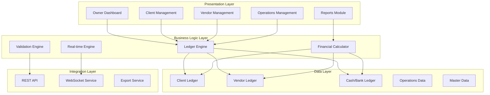

# Design Document: PGT TMS Accounting Transformation

## Overview

This design transforms the existing PGT Transport Management System into a comprehensive master accounting-driven management system. The transformation centers around implementing a robust ledger engine that maintains strict separation between income (client/rent) and expenses (vendor/operational), while providing real-time financial visibility through an owner-focused dashboard.

The system follows double-entry bookkeeping principles adapted for transport operations, ensuring every financial transaction maintains proper audit trails and balance integrity. The design prioritizes real-time calculations, entity-agnostic architecture, and comprehensive financial reporting capabilities.

## Architecture

### High-Level Architecture



### Core Architectural Principles

1. **Ledger-First Design**: All financial transactions flow through the ledger engine
2. **Real-time Calculations**: Financial metrics update immediately upon transaction entry
3. **Entity-Agnostic**: No hardcoded business names or specific entity references
4. **Audit-Safe**: Immutable transaction records with complete audit trails
5. **Scalable**: Designed to handle growing transaction volumes and user base

## Components and Interfaces

### 1. Ledger Engine

The core component implementing double-entry bookkeeping principles adapted for transport operations.

**Key Responsibilities:**
- Maintain running balances using: Opening Balance + Credits - Debits = Running Balance
- Ensure transaction integrity and immutability
- Provide real-time balance calculations
- Support multiple ledger types (Client, Vendor, Cash/Bank)

**Interface:**
```python
class LedgerEngine:
    def create_entry(self, ledger_type: str, entity_id: int, 
                    transaction_data: TransactionData) -> LedgerEntry
    def get_running_balance(self, ledger_type: str, entity_id: int) -> float
    def get_ledger_history(self, ledger_type: str, entity_id: int, 
                          date_range: DateRange) -> List[LedgerEntry]
    def validate_transaction(self, transaction_data: TransactionData) -> ValidationResult
```

### 2. Client/Rent Management Module

Manages all client receivables and rent agreements with strict separation from vendor costs.

**Key Features:**
- Client registration and agreement management
- Rent raising (debit entries)
- Payment recording (credit entries)
- Balance tracking and aging analysis

**Business Rules:**
- Vendor charges must never reduce rent amounts
- All rent-related transactions flow through Client_Ledger
- Client balance = Previous Balance + Rent Raised - Payment Received

### 3. Vendor Management Module

Handles all vendor payables and expense tracking with complete separation from client income.

**Key Features:**
- Vendor registration and profile management
- Charge recording (credit entries)
- Payment processing (debit entries)
- Payable tracking and due date management

**Business Rules:**
- All vendor costs remain in vendor module
- No mixing with rent calculations
- Vendor balance = Previous Balance + Charges - Payments

### 4. Operations/Job Integration Module

Integrates operational data with financial calculations while maintaining proper accounting separation.

**Key Features:**
- Job profitability calculation: Revenue - (Fuel + Advance + Other Costs)
- Operational expense categorization
- Integration with existing trip/fleet management
- Cost allocation and tracking

### 5. Financial Calculator

Provides real-time master financial calculations across all modules.

**Calculations:**
- Total Receivable = SUM(All Client_Ledger balances where balance > 0)
- Total Payable = SUM(All Vendor_Ledger balances where balance > 0)
- Total Income = Rent_Income + Operational Revenue
- Total Expenses = Vendor_Charges + Office Expenses + Operational Costs
- Net Profit = Total Income - Total Expenses
- Daily Cash Flow = Daily Income - Daily Outgoing

### 6. Owner Dashboard

Provides comprehensive financial overview designed for 10-second business health assessment.

**Dashboard Sections:**
- **Top Summary Cards**: Total Receivable, Total Payable, Net Profit/Loss, Cash/Bank Balance
- **Today's Snapshot**: Today's Income, Today's Expenses, Today's Net Cash Flow
- **Breakdowns**: Top 5 Clients by Receivable, Top 5 Vendors by Payable
- **Visual Analytics**: Expense charts, Income vs Expense trends
- **Alerts**: Overdue receivables, Outstanding vendor balances, Negative cash flow days

### 7. Reporting Engine

Generates comprehensive financial reports with export capabilities.

**Report Types:**
- Client Ledger (date filtered)
- Vendor Ledger (date filtered)
- Profit & Loss Statement
- Daily Cash Flow Report
- Monthly Summary
- Export formats: PDF, Excel

## Data Models

### Core Ledger Structure

```python
class LedgerEntry:
    id: int
    ledger_type: str  # 'client', 'vendor', 'cash_bank'
    entity_id: int
    date: datetime
    description: str
    debit_amount: float = 0.0
    credit_amount: float = 0.0
    running_balance: float  # Calculated field
    reference_no: str
    transaction_type: str
    created_at: datetime
    created_by: int
    is_immutable: bool = True  # Prevents modification after creation
```

### Enhanced Client Model

```python
class Client:
    id: int
    client_code: str  # Auto-generated unique identifier
    name: str
    agreement_reference: str
    contact_details: ContactInfo
    current_balance: float  # Calculated from ledger
    credit_limit: float
    payment_terms: int  # Days
    is_active: bool
    created_at: datetime
    
    # Relationships
    ledger_entries: List[LedgerEntry]
    agreements: List[ClientAgreement]
```

### Enhanced Vendor Model

```python
class Vendor:
    id: int
    vendor_code: str  # Auto-generated unique identifier
    name: str
    contact_details: ContactInfo
    current_balance: float  # Calculated from ledger
    payment_terms: int  # Days
    tax_details: TaxInfo
    is_active: bool
    created_at: datetime
    
    # Relationships
    ledger_entries: List[LedgerEntry]
    contracts: List[VendorContract]
```

### Financial Transaction Model

```python
class FinancialTransaction:
    id: int
    transaction_date: datetime
    transaction_type: str  # 'rent_raised', 'payment_received', 'vendor_charge', 'vendor_payment'
    amount: float
    description: str
    reference_no: str
    
    # Polymorphic relationships
    client_id: Optional[int]
    vendor_id: Optional[int]
    job_id: Optional[int]
    
    # Audit fields
    created_by: int
    approved_by: Optional[int]
    approval_status: str
    created_at: datetime
```

### Enhanced Operations Model

```python
class JobOperation:
    id: int
    job_reference: str
    date: datetime
    client_id: int
    vehicle_id: int
    
    # Revenue components
    gross_revenue: float
    
    # Cost components
    fuel_cost: float
    advance_paid: float
    other_operational_costs: float
    vendor_charges: float  # Links to vendor transactions
    
    # Calculated fields
    net_job_result: float  # Revenue - (Fuel + Advance + Other + Vendor)
    profit_margin: float  # (Net Result / Revenue) * 100
    
    # Status and metadata
    status: str
    created_at: datetime
    completed_at: Optional[datetime]
```

## Error Handling

### Transaction Validation

1. **Balance Validation**: Ensure sufficient balance for debit transactions
2. **Date Validation**: Prevent backdated entries beyond configured limits
3. **Duplicate Prevention**: Check for duplicate reference numbers
4. **Amount Validation**: Ensure positive amounts and reasonable limits
5. **Entity Validation**: Verify client/vendor exists and is active

### Error Recovery

1. **Transaction Rollback**: Automatic rollback on validation failures
2. **Audit Logging**: Complete error logging with user context
3. **User Feedback**: Clear, actionable error messages
4. **Data Integrity**: Automatic balance recalculation on error recovery

### System Resilience

1. **Database Constraints**: Enforce data integrity at database level
2. **Concurrent Access**: Handle multiple users modifying same entities
3. **Backup and Recovery**: Automated backup with point-in-time recovery
4. **Performance Monitoring**: Real-time monitoring of calculation performance

## Testing Strategy

### Dual Testing Approach

The system requires both unit testing and property-based testing for comprehensive coverage:

**Unit Tests:**
- Specific examples and edge cases
- Integration points between modules
- Error conditions and validation scenarios
- User interface interactions

**Property-Based Tests:**
- Universal properties that hold for all inputs
- Comprehensive input coverage through randomization
- Minimum 100 iterations per property test
- Each test tagged with: **Feature: pgt-tms-accounting-transformation, Property {number}: {property_text}**

### Property-Based Testing Configuration

- **Testing Library**: Use Hypothesis (Python) for property-based testing
- **Test Configuration**: Minimum 100 iterations per property test
- **Coverage**: Each correctness property implemented by a single property-based test
- **Integration**: Property tests run alongside unit tests in CI/CD pipeline

### Testing Focus Areas

1. **Ledger Engine**: Balance calculations, transaction integrity, concurrent access
2. **Financial Calculations**: Real-time updates, accuracy across modules
3. **Data Validation**: Business rules, constraints, error handling
4. **User Interface**: Dashboard updates, form validation, report generation
5. **Integration**: API endpoints, data synchronization, export functionality

## Correctness Properties

*A property is a characteristic or behavior that should hold true across all valid executions of a system—essentially, a formal statement about what the system should do. Properties serve as the bridge between human-readable specifications and machine-verifiable correctness guarantees.*

Based on the prework analysis and property reflection to eliminate redundancy, the following properties validate the core correctness requirements of the accounting transformation:

### Property 1: Unique Entity Registration
*For any* client or vendor registration, the system should generate a unique identifier and store all provided details without data loss or ID collision.
**Validates: Requirements 1.1, 2.1**

### Property 2: Ledger Entry Creation Consistency
*For any* financial transaction (rent raised, payment received, vendor charge, vendor payment), the system should create the correct ledger entry type (debit/credit) in the appropriate ledger.
**Validates: Requirements 1.2, 1.3, 2.2, 2.3**

### Property 3: Universal Balance Calculation
*For any* ledger (client, vendor, cash/bank) and any sequence of transactions, the running balance should equal: Opening Balance + Credits - Debits.
**Validates: Requirements 1.4, 2.4, 5.2**

### Property 4: Financial Separation Integrity
*For any* vendor transaction, it should never affect client rent calculations, and vice versa - vendor costs should remain completely separate from rent income.
**Validates: Requirements 1.5, 2.5**

### Property 5: Job Profitability Calculation
*For any* completed job with revenue and cost components, the Net Job Result should equal: Revenue - (Fuel + Advance + Other Costs).
**Validates: Requirements 3.1**

### Property 6: Expense Categorization Consistency
*For any* expense entry, it should be correctly categorized as either vendor expense or operational expense, with proper separation maintained in displays and calculations.
**Validates: Requirements 4.1, 4.3**

### Property 7: Master Financial Calculations
*For any* system state with client and vendor balances, the master calculations should be: Total Receivable = SUM(positive client balances), Total Payable = SUM(positive vendor balances), Net Profit = Total Income - Total Expenses.
**Validates: Requirements 6.1, 6.2, 6.3, 6.4, 6.5**

### Property 8: Daily Cash Flow Calculations
*For any* date, Daily Net Cash Flow should equal: SUM(payments received today) - SUM(payments made today).
**Validates: Requirements 7.1, 7.2, 7.3**

### Property 9: Dashboard Information Completeness
*For any* dashboard load, all required summary cards (Total Receivable, Total Payable, Net Profit/Loss, Cash/Bank Balance) and today's snapshot should be displayed with accurate data.
**Validates: Requirements 8.1, 8.2**

### Property 10: Real-time Update Consistency
*For any* financial transaction, all affected calculations, dashboards, and displays should update immediately to reflect the new transaction.
**Validates: Requirements 5.4, 6.6, 8.6, 11.2**

### Property 11: Ledger Immutability
*For any* ledger entry once created, it should remain immutable and any attempt to modify it should be prevented.
**Validates: Requirements 5.5**

### Property 12: Report Data Accuracy
*For any* generated report (Client Ledger, Vendor Ledger, P&L, Cash Flow), the data should exactly match the underlying ledger balances and calculations.
**Validates: Requirements 9.1, 9.2, 9.3, 9.4, 9.5, 9.7**

### Property 13: Data Validation and Error Prevention
*For any* invalid data entry (negative amounts, duplicate references, invalid dates), the system should prevent submission and display clear error messages.
**Validates: Requirements 10.1, 10.4, 10.6**

### Property 14: Role-based Access Control
*For any* user with a specific role (Owner, Manager, Operator), they should only be able to access and modify data according to their permission level.
**Validates: Requirements 10.5**

### Property 15: Data Migration Integrity
*For any* existing data being migrated, it should be converted to the new accounting structure without data loss and maintain referential integrity.
**Validates: Requirements 12.1, 12.2, 12.3, 12.4**

### Property 16: Export Format Consistency
*For any* report exported in PDF or Excel format, it should contain the same data as displayed in the system interface.
**Validates: Requirements 9.6**

### Property 17: Audit Trail Completeness
*For any* financial transaction or ledger modification, complete audit information (user, timestamp, action) should be recorded and accessible.
**Validates: Requirements 5.6, 11.3**

### Property 18: Dynamic Dropdown Population
*For any* dropdown field in the system, the options should be dynamically populated from current system data and remain up-to-date.
**Validates: Requirements 10.2**

### Property 19: Date Filtering Functionality
*For any* financial screen with date filtering, the filter should correctly limit displayed data to the specified date range.
**Validates: Requirements 10.3**

### Property 20: Alert Generation Logic
*For any* system state with overdue receivables, outstanding vendor balances, or negative cash flow, appropriate alerts should be generated and displayed.
**Validates: Requirements 8.5**